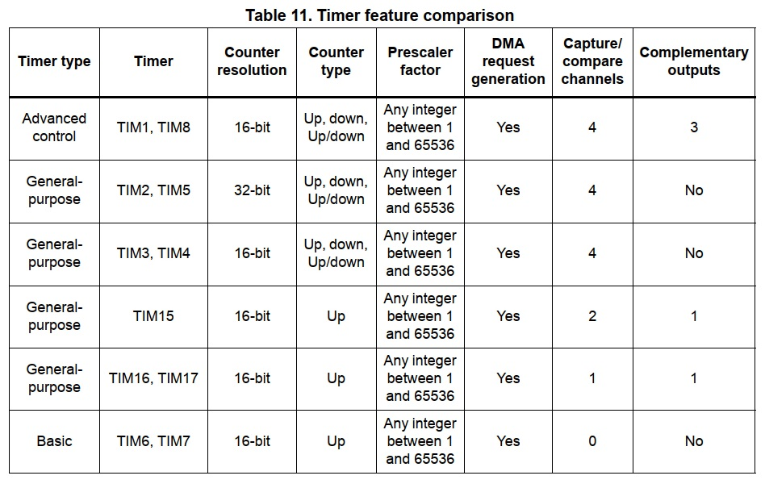

Kocherga
========

## IMPORTANT : This branch is in developpment

Now in dev to change the hardware target from STM32F4 to STM32L4.

### Errors

#### Error 1
F4 has the TIM3 of 32 bits but L4 have TIM3 of 16 bits

```
chibios/os/hal/ports/STM32/LLD/TIMv1/hal_st_lld.c:68:2: error: #error "TIM3 is not a 32bits timer"
```

[STM32L4 page 50](https://www.st.com/resource/en/datasheet/stm32l496re.pdf) => TIM3 16 bits

[STM32F4 page 31](https://www.st.com/resource/en/datasheet/stm32f446re.pdf) => TIM3 32 bits



### Solution 1

Change TIM3 into TIM5 in `/src/board/board.cpp` with your replacing tool. You should have something like this :
```
    TIM5->PSC = FrequencyDivisionRatio - 1U;
    TIM5->ARR = 0xFFFF;
    TIM5->CR1 = 0;
    TIM5->CR2 = 0;
```
In `/src/os/mcuconf.cpp` line 284 change 
```
#define STM32_ST_USE_TIMER                  3
```
into 
```
#define STM32_ST_USE_TIMER                  5
```

### Error 2
```
chibios/os/hal/ports/STM32/LLD/TIMv1/hal_st_lld.c:123:2: error: #error "ST requires TIM5 but the timer is already used"
 #error "ST requires TIM5 but the timer is already used"
```

## Start of tutorial

You need the `korchega-demo` directory to continue. 

You can download it  : [here](https://forum.uavcan.org/uploads/default/original/1X/ff46c01e949be32df97402b1bfd25677c0c226f6.gz) the link is provided by [Pavel Kirienko](https://forum.uavcan.org/t/canardrxtransfer-payload-reading/600/17)
## Before all (Arthur)
### ARM GCC
Download the specific toolchain for ARM GCC 7.3 here : https://majenko.co.uk/downloads/arm-gcc-731-compiler-2018-q2

or here : https://developer.arm.com/tools-and-software/open-source-software/developer-tools/gnu-toolchain/gnu-rm/downloads

You have to choose your OS.

### Setup the path
Make a place to install it to
```
mkdir /usr/local/gcc_arm
```

Move the unzipped stuff there.
```
mv ~/Downloads/gcc-arm-none-eabi-4_7-2013q3 /usr/local/gcc_arm/
```

Check out all the purdy binaries, you'll need to build firmware.
```
ls /usr/local/gcc_arm/gcc-arm-none-eabi-7-2018-q2-update/bin/
```


Peep your current PATH
```
echo $PATH
```
```
/usr/local/heroku/bin:/usr/local/bin:/usr/bin:/bin:/usr/sbin:/sbin:<BLA BLA BLA>
```

Change your PATH by appending the "bin" folder of the folder

NOTE: You should also add this line to ~/.bashrc or ~/.bash_profile (in your home directory)
so you don't have to remember to do this every time you want to compile firmware.
```
export PATH="$PATH:/usr/local/gcc_arm/gcc-arm-none-eabi-7-2018-q2-update/bin/"
```
Check to ensure the gcc-arm firmware compiler is available (so `make clean dependents all` will work.)
```
arm-none-eabi-gcc --version
```


## Building

In order to build the bootloader, execute `make RELEASE=1`.
Omit setting the `RELEASE` variable to build the debug version (it won't fit into the bootloader area).

```
cd build/
ls -la
```
You should have :
```
bootloader.bin
bootloader.elf
kocherga_demo.map
lst
obj
```

Once the release version of the bootloader is built, its binary (`.bin`)
will have to be manually copied into the firmware source root directory.
This is arranged this way to ensure that once a working version of bootloader is finished and tested,
it will stay frozen in this exact configuration until updated explicitly.
The bootloader has to be robust and is not expected to change frequently.

## MCU Usage

### Timers

The following list documents the current usage of hardware timers.
All timers are clocked at 180 MHz.
Note that ChibiOS 16.1 does not recognize that; please read this post for details:
<http://www.chibios.com/forum/viewtopic.php?f=35&t=3870>.

Timer   | Resolution| Usage
--------|-----------|--------------------------------------------------------------------------------------------------
TIM1    | 16        | *Not used*
TIM2    | **32**    | RTOS System Timer (tickless)
TIM3    | 16        | RGB LED PWM
TIM4    | 16        | *Not used*
TIM5    | **32**    | *Not used*
TIM6    | 16        | *Not used*
TIM7    | 16        | *Not used*
TIM8    | 16        | *Not used*
TIM9    | 16        | *Not used*
TIM10   | 16        | *Not used*
TIM11   | 16        | *Not used*
TIM12   | 16        | *Not used*
TIM13   | 16        | *Not used*
TIM14   | 16        | *Not used*

### Watchdog

Release builds of the bootloader initialize the watchdog with a large timeout.
This is needed to prevent broken firmwares from bricking the device.

Debug builds to not initialize the watchdog in order to not interfere with debugging.

### RCC

The RCC CSR register contains reset cause flags.
If either of the watchdog timers is known to have caused the last reset,
the bootloader will inject a 10 second timeout before booting the application,
allowing external systems or the user to intervene and replace the bad firmware.
The reset cause flags are cleared by the bootloader.
