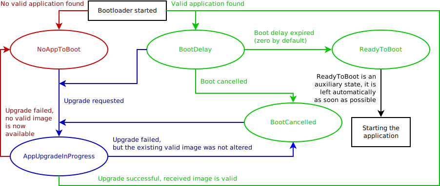

# Kochergá

**Kochergá is a robust portable multi-protocol bootloader for deeply embedded systems.**

## Features

### Portability

Kochergá has no external dependencies
(although protocol implementations may require their own dependencies).

Kocherga is written in standard C++17 and is distributed as a header-only library.

### Robustness

Kochergá is brick-proof.

The application (i.e. firmware) update process can be interrupted at any point (e.g. by turning off the power supply
or by disconnecting the interface), and it is guaranteed that the device will always end up in
a known valid state.
No matter what happens during the update process, Kochergá won't let the user brick the device.

Even if a misbehaving application image was uploaded, Kochergá always can take control and let the user replace it.

### Security

Kochergá verifies the correctness of the application (i.e. firmware) image with a strong 64-bit hash function
before every boot.

### Supported protocols

Kochergá supports several communication interfaces and protocols:

Interface           | Protocols
--------------------|------------------------------------------------------------------------------
Serial (USB/UART)   | XMODEM, YMODEM, XMODEM-1K, Popcop
CAN bus             | UAVCAN

## Usage

Just read the code ;)

The entire library is contained in the header file `kocherga.hpp`;
protocol implementations are provided each in a separate header file named `kocherga_*.hpp`.
For example, the YMODEM-family protocols are implemented in the header file `kocherga_ymodem.hpp`;
the UAVCAN protocol is implemented in the file `kocherga_uavcan.hpp`, etc.
You don't need to use all of them, of course; just take what you need.

Kocherga does not have any compilation units of its own, so just include the required headers and you're ready to roll.

When implementing support for new protocols, please follow the same naming convention:
`kocherga_whatever.hpp` for the header file, where `whatever` is the name of the protocol;
the implementation should be contained in a namespace eponymous with the header file,
e.g. `::kocherga_whatever`.

To integrate Kocherga into your application, just include this repository as a git submodule,
or simply copy-paste the required header files into your source tree.

The core logic is implemented in the class `kocherga::BootloaderController`.
Instantiate this class once in your application and use it to perform application updates as necessary
using one of the provided (or custom!) protocol implementations.

The bootloader will be looking for an instance of the `AppInfo` structure located in the ROM image of the
application.
Only if a valid `AppInfo` structure is found the application will be launched.
It is recommended to allocate the structure closer to the beginning of the image in order to speed up its verification.
The structure contains the following fields:

Offset | Type     | Description
-------|----------|-----------------------------------------------------------------------------------------------------
0      |`uint8[8]`| Eight constant ASCII characters: `APDesc00`.
8      |`uint64`  | CRC-64-WE of the entire application image when this field itself is set to zero.
16     |`uint32`  | Size of the application image, in bytes. Note that the image must be padded to eight bytes.
20     |`uint32`  | Version control system (VCS) revision ID. For example, a git hash, or an SVN revision number.
24     |`uint8`   | Major semantic version number.
25     |`uint8`   | Minor semantic version number.
26     |`uint8`   | Flags: 1 - this is a release build; 2 - this is a dirty build (uncommitted changes present).
27     |          | Reserved; set to 0xFF.
28     |`uint32`  | UNIX build timestamp, UTC; i.e. the number of seconds since 1970-01-01T00:00:00Z.

When computing the application image CRC, the process will eventually encounter the location where the CRC itself
is stored. In order to avoid recursive dependency, the CRC storage location must be replaced with zero bytes
when computing/verifying the CRC.
The parameters of the CRC-64 algorithm are the following:
* Initial value: 0xFFFF'FFFF'FFFF'FFFF
* Polynomial: 0x42F0'E1EB'A9EA'3693
* Reverse: no
* Output xor: 0xFFFF'FFFF'FFFF'FFFF
* Check: 0x62EC'59E3'F1A4'F00A

The following diagram documents the state machine implemented in the `BootloaderController` class:

## Protocols

As has been stated earlier, Kocherga itself is dependency-free.
However, protocol implementations may require additional dependencies themselves.
They are documented here.

### XMODEM/YMODEM/XMODEM-1K

No additional dependencies are needed.

### UAVCAN

The UAVCAN protocol support requires the following libraries:

* [Libcanard](http://uavcan.org/Implementations/Libcanard) - lightweight UAVCAN stack in C.
* [Senoval](https://github.com/Zubax/senoval) - utility library for deeply embedded systems.

The bootloader states are mapped onto UAVCAN node states as follows:

Bootloader state     | Node mode      | Node health
---------------------|----------------|----------------
NoAppToBoot          | SoftwareUpdate | Error
BootDelay            | Initialization | Ok
BootCancelled        | SoftwareUpdate | Warning
AppUpgradeInProgress | SoftwareUpdate | Ok
ReadyToBoot          | Initialization | Ok

### Popcop

The Popcop protocol support requires the following libraries:

* [Libpopcop](https://github.com/Zubax/popcop) - implementation of the Popcop protocol in C++.

## License

Kochergá is available under the terms of the MIT License.
